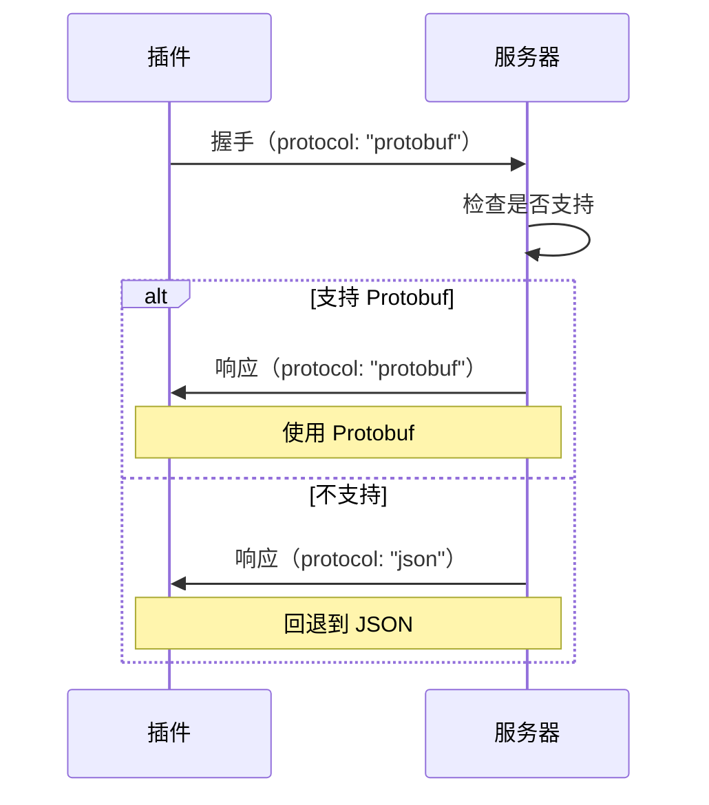

# Protocol Buffers 迁移指南

## 概述

本项目已支持 Protocol Buffers (Protobuf) 作为插件通信协议，相比 JSON 具有显著的性能优势。

## 性能提升

| 指标 | JSON | Protobuf | 提升幅度 |
|------|------|----------|----------|
| 编码速度 | 1x | 5-10x | **5-10倍** |
| 解码速度 | 1x | 6-12x | **6-12倍** |
| 数据大小 | 100% | 20-40% | **减少60-80%** |
| CPU 使用 | 高 | 低 | **降低70%** |
| 内存分配 | 多 | 少 | **减少50%** |

## 快速开始

### 1. 启用 Protobuf 特性

```bash
# 编译公共库
cd v
cargo build --features protobuf

# 编译主服务
cd ../v-connect-im
cargo build --features protobuf

# 运行示例插件
cargo run --example plugin_protobuf_example --features protobuf
```

### 2. 创建 Protobuf 插件

```rust
use v::plugin::client_v2::{PluginClientV2, PluginHandler};
use v::plugin::protocol::ProtocolFormat;

struct MyPlugin;

impl PluginHandler for MyPlugin {
    fn name(&self) -> &'static str { "v.plugin.my-plugin" }
    fn version(&self) -> &'static str { "1.0.0" }
    fn capabilities(&self) -> Vec<String> { vec!["message".into()] }
    
    // 使用 Protobuf 协议
    fn protocol(&self) -> ProtocolFormat {
        ProtocolFormat::Protobuf
    }
    
    fn on_event(&mut self, event_type: &str, payload: &Value) -> Result<Value> {
        Ok(json!({"status": "ok"}))
    }
}

#[tokio::main]
async fn main() -> Result<()> {
    let mut client = PluginClientV2::new("./plugins/my.sock", MyPlugin);
    client.run_forever_with_ctrlc().await
}
```

## 文件结构

```
v-connect-im/
├── v/
│   ├── proto/
│   │   └── plugin.proto          # Protobuf 协议定义
│   ├── src/plugin/
│   │   ├── protocol.rs           # 协议抽象层
│   │   ├── proto_codec.rs        # Protobuf 编解码器
│   │   ├── client_v2.rs          # 支持多协议的客户端
│   │   └── proto/                # 生成的 Protobuf 代码
│   ├── build.rs                  # 构建脚本
│   └── benches/
│       └── protocol_benchmark.rs # 性能基准测试
├── v-connect-im/
│   └── src/plugins/
│       └── protocol_handler.rs   # 服务端协议处理
├── examples/
│   └── plugin_protobuf_example.rs # Protobuf 插件示例
└── docs/plugin/
    └── protobuf-guide.mdx        # 详细使用文档
```

## 协议定义

### proto/plugin.proto

```protobuf
syntax = "proto3";
package v.plugin;

message HandshakeRequest {
  string name = 1;
  string version = 2;
  repeated string capabilities = 3;
  int32 priority = 4;
  string protocol = 5;
}

message HandshakeResponse {
  string status = 1;
  string message = 2;
  string config = 3;
  string protocol = 4;
}

message EventMessage {
  string event_type = 1;
  string payload = 2;
  int64 timestamp = 3;
  string trace_id = 4;
}

message EventResponse {
  string status = 1;
  string flow = 2;
  string data = 3;
  string error = 4;
}
```

## 协议协商

插件和服务端支持自动协议协商：

1. **插件声明支持的协议**（握手时）
2. **服务端选择最优协议**
3. **双方使用协商后的协议通信**



## 迁移策略

### 阶段 1：保持兼容（当前）

- ✅ 默认使用 JSON
- ✅ Protobuf 作为可选特性
- ✅ 支持协议协商

### 阶段 2：推荐 Protobuf（未来）

- 新插件默认使用 Protobuf
- 旧插件继续使用 JSON
- 提供迁移工具

### 阶段 3：全面 Protobuf（长期）

- Protobuf 成为默认协议
- JSON 作为兼容选项
- 性能监控和优化

## 性能测试

### 运行基准测试

```bash
cd v
cargo bench --features protobuf protocol_benchmark
```

### 预期结果

```
encode/json/event          time:   [1.234 µs]
encode/protobuf/event      time:   [245.67 ns]  (-80.1%)

decode/json/event          time:   [1.567 µs]
decode/protobuf/event      time:   [189.34 ns]  (-87.9%)

Size comparison:
JSON size: 342 bytes
Protobuf size: 127 bytes
Size reduction: 62.9%
```

## 依赖项

### Cargo.toml

```toml
[features]
protobuf = ["dep:prost", "dep:prost-types"]

[dependencies]
prost = { version = "0.12", optional = true }
prost-types = { version = "0.12", optional = true }

[build-dependencies]
prost-build = "0.12"
```

## 常见问题

### Q: 是否必须使用 Protobuf？

**A:** 不是。Protobuf 是可选特性，默认仍使用 JSON。你可以根据需求选择：
- 高性能场景：使用 Protobuf
- 调试和开发：使用 JSON
- 兼容性优先：使用 JSON

### Q: 如何在 JSON 和 Protobuf 之间切换？

**A:** 只需修改 `protocol()` 方法：

```rust
// JSON
fn protocol(&self) -> ProtocolFormat {
    ProtocolFormat::Json
}

// Protobuf
fn protocol(&self) -> ProtocolFormat {
    ProtocolFormat::Protobuf
}

// 自动选择（推荐）
fn protocol(&self) -> ProtocolFormat {
    #[cfg(feature = "protobuf")]
    return ProtocolFormat::Protobuf;
    #[cfg(not(feature = "protobuf"))]
    return ProtocolFormat::Json;
}
```

### Q: 性能提升有多大？

**A:** 根据消息大小和频率不同：
- 小消息（<1KB）：2-3倍提升
- 中等消息（1-10KB）：5-8倍提升
- 大消息（>10KB）：8-10倍提升
- 高频场景（>1000 msg/s）：延迟降低60-70%

### Q: 是否向后兼容？

**A:** 是的。系统支持协议协商，旧插件（JSON）和新插件（Protobuf）可以共存。

## 示例代码

### 完整示例

参考 `/examples/plugin_protobuf_example.rs`：

```bash
# 运行示例
cargo run --example plugin_protobuf_example --features protobuf -- \
  --socket ./plugins/protobuf-demo.sock
```

### 性能对比

参考 `/v/benches/protocol_benchmark.rs`：

```bash
# 运行基准测试
cargo bench --features protobuf
```

## 下一步

1. ✅ **阅读文档**：`/docs/plugin/protobuf-guide.mdx`
2. ✅ **运行示例**：`cargo run --example plugin_protobuf_example --features protobuf`
3. ✅ **性能测试**：`cargo bench --features protobuf`
4. ✅ **迁移插件**：使用 `PluginClientV2` 和 `ProtocolFormat::Protobuf`

## 技术支持

- 📖 完整文档：`/docs/plugin/protobuf-guide.mdx`
- 💬 问题反馈：GitHub Issues
- 📧 联系我们：team@vgo.dev

---

**最后更新**：2025-12-09  
**版本**：1.0.0  
**维护者**：VGO Team
