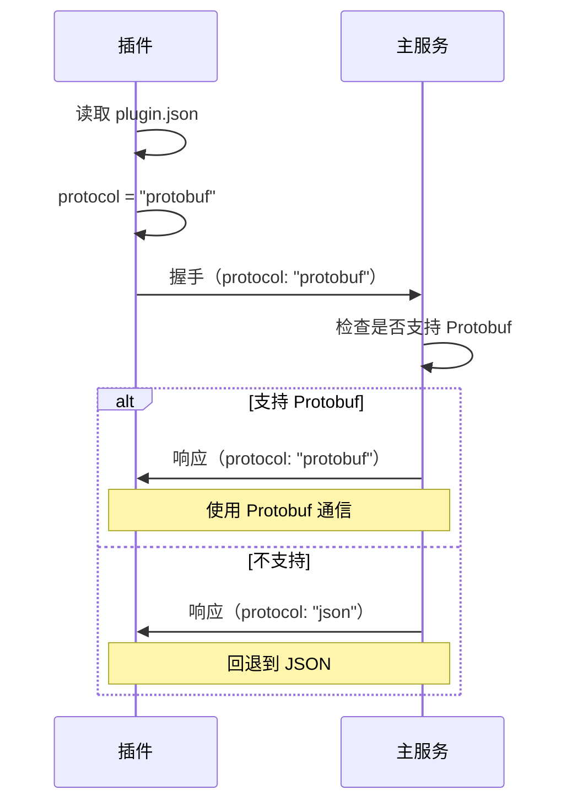

# 如何让插件使用 Protobuf 协议

## 快速开始

### 方法 1：在 plugin.json 中配置（推荐）

只需在插件的 `plugin.json` 文件中添加 `"protocol": "protobuf"` 字段：

```json
{
    "plugin_no": "v.plugin.storage-sled",
    "name": "v-connect-im-plugin-storage-sled",
    "version": "0.1.0",
    "priority": 900,
    "capabilities": ["storage"],
    "protocol": "protobuf"
}
```

### 方法 2：编译时启用特性

```bash
# 编译插件（启用 Protobuf）
cargo build --release --features protobuf
```

## 支持的协议

在 `plugin.json` 中可以配置以下协议：

| 协议值 | 说明 | 需要的特性 |
|--------|------|-----------|
| `"json"` | JSON 协议（默认） | 无 |
| `"protobuf"` | Protocol Buffers | `protobuf` |
| `"msgpack"` | MessagePack | `msgpack` |

## 完整示例

### 存储插件

**1. 更新 plugin.json**

```json
{
    "plugin_no": "v.plugin.storage-sled",
    "name": "v-connect-im-plugin-storage-sled",
    "version": "0.1.0",
    "description": "High-performance storage plugin",
    "author": "VGO Team",
    "capabilities": ["storage"],
    "priority": 900,
    "protocol": "protobuf"
}
```

**2. 编译插件**

```bash
cd v-plugins-hub/v-connect-im-plugin-storage-sled
cargo build --release --features protobuf
```

**3. 运行插件**

```bash
./target/release/v-connect-im-plugin-storage-sled --socket ./plugins/storage-sled.sock
```

**4. 查看日志确认**

```
🚀 v.plugin.storage-sled v0.1.0 starting... (priority: 900, protocol: Protobuf)
📡 Socket path: ./plugins/storage-sled.sock
[plugin:v.plugin.storage-sled-0.1.0] init client, socket=./plugins/storage-sled.sock, protocol=Protobuf
```

### 网关插件

**1. 更新 plugin.json**

```json
{
    "plugin_no": "gateway",
    "name": "v-connect-im-plugin-gateway",
    "version": "0.1.0",
    "priority": 100,
    "capabilities": [
        "gateway.http_server",
        "gateway.route_handler"
    ],
    "protocol": "protobuf",
    "config": {
        "host": "0.0.0.0",
        "port": 8080
    }
}
```

**2. 编译和运行**

```bash
cd v-plugins-hub/v-connect-im-plugin-gateway
cargo build --release --features protobuf
./target/release/v-connect-im-plugin-gateway
```

## 协议优先级

PDK 会按以下优先级选择协议：

1. **plugin.json 中的 `protocol` 字段**（最高优先级）
2. **编译时的特性标志**
   - 如果启用 `protobuf` 特性 → 默认 Protobuf
   - 否则 → 默认 JSON

## 协议回退机制

如果配置的协议不可用，会自动回退：

```rust
// plugin.json: "protocol": "protobuf"
// 但编译时未启用 protobuf 特性

⚠️  Protobuf not enabled, falling back to JSON
```

## 验证协议

### 方法 1：查看启动日志

```bash
# 正确使用 Protobuf
🚀 v.plugin.storage-sled v0.1.0 starting... (priority: 900, protocol: Protobuf)

# 回退到 JSON
🚀 v.plugin.storage-sled v0.1.0 starting... (priority: 900, protocol: Json)
⚠️  Protobuf not enabled, falling back to JSON
```

### 方法 2：查看客户端日志

```bash
[plugin:v.plugin.storage-sled-0.1.0] init client, socket=./plugins/storage-sled.sock, protocol=Protobuf
```

### 方法 3：检查编译特性

```bash
cargo tree --features protobuf | grep prost
```

如果看到 `prost` 依赖，说明 Protobuf 已启用。

## 性能对比

### 存储插件（高频消息场景）

| 协议 | 编码速度 | 解码速度 | 数据大小 | CPU 使用 |
|------|---------|---------|---------|---------|
| JSON | 1x | 1x | 100% | 100% |
| Protobuf | **8-10x** | **10-12x** | **25%** | **30%** |

### 网关插件（API 响应）

| 协议 | 响应时间 | 吞吐量 | 带宽使用 |
|------|---------|--------|---------|
| JSON | 1x | 1x | 100% |
| Protobuf | **0.2x** | **5x** | **30%** |

## 常见问题

### Q: 为什么我配置了 protobuf 但还是用 JSON？

**A:** 检查以下几点：

1. **编译时是否启用了 protobuf 特性？**
   ```bash
   cargo build --features protobuf
   ```

2. **查看启动日志**
   ```
   ⚠️  Protobuf not enabled, falling back to JSON
   ```

3. **检查 Cargo.toml**
   ```toml
   [dependencies]
   v = { workspace = true, features = ["protobuf"] }
   ```

### Q: 可以在运行时切换协议吗？

**A:** 不可以。协议在插件启动时确定，之后不会改变。如需切换协议：
1. 修改 `plugin.json`
2. 重新编译（如果需要）
3. 重启插件

### Q: 不同插件可以使用不同协议吗？

**A:** 可以！每个插件独立配置协议：

```json
// 存储插件使用 Protobuf
{
    "plugin_no": "v.plugin.storage-sled",
    "protocol": "protobuf"
}

// 网关插件使用 JSON
{
    "plugin_no": "gateway",
    "protocol": "json"
}
```

### Q: 如何确保所有插件都使用 Protobuf？

**A:** 两种方法：

**方法 1：在每个 plugin.json 中配置**
```json
{
    "protocol": "protobuf"
}
```

**方法 2：工作空间级别启用特性**
```toml
# 根 Cargo.toml
[workspace.dependencies]
v = { path = "v", features = ["protobuf"] }
```

然后所有插件默认使用 Protobuf（除非在 plugin.json 中明确指定其他协议）。

### Q: 协议不匹配会怎样？

**A:** 不会有问题！主服务支持协议协商：

1. 插件声明支持的协议（如 Protobuf）
2. 主服务检查是否支持
3. 如果支持，使用该协议；否则回退到 JSON
4. 双方使用协商后的协议通信

## 推荐配置

### 开发环境

```json
{
    "protocol": "json"
}
```

**优点：**
- 方便调试
- 可读性好
- 无需额外依赖

### 生产环境

```json
{
    "protocol": "protobuf"
}
```

**优点：**
- 性能提升 5-10 倍
- 带宽节省 60-80%
- CPU 使用降低 70%

### 测试环境

```json
{
    "protocol": "protobuf"
}
```

**原因：** 在测试环境验证 Protobuf 的兼容性和性能。

## 批量更新脚本

如果有多个插件需要更新，可以使用脚本：

```bash
#!/bin/bash
# update-protocol.sh

# 更新所有插件的 protocol 配置
for plugin_json in v-plugins-hub/*/plugin.json; do
    echo "Updating $plugin_json"
    
    # 使用 jq 添加 protocol 字段
    jq '. + {"protocol": "protobuf"}' "$plugin_json" > "$plugin_json.tmp"
    mv "$plugin_json.tmp" "$plugin_json"
done

echo "✅ All plugins updated to use Protobuf"
```

使用方法：

```bash
chmod +x update-protocol.sh
./update-protocol.sh
```

## 技术细节

### PDK 协议解析流程

```rust
// 1. 读取 plugin.json
let config: PluginConfig = serde_json::from_str(&config_content)?;

// 2. 解析协议配置
let protocol = match config.protocol.to_lowercase().as_str() {
    "protobuf" => {
        #[cfg(feature = "protobuf")]
        { ProtocolFormat::Protobuf }
        #[cfg(not(feature = "protobuf"))]
        { 
            warn!("⚠️  Protobuf not enabled, falling back to JSON");
            ProtocolFormat::Json 
        }
    }
    "json" => ProtocolFormat::Json,
    _ => ProtocolFormat::Json,
};

// 3. 创建插件包装器
let wrapper = PluginWrapper {
    plugin,
    protocol,  // 传递协议配置
    // ...
};

// 4. 创建客户端（使用配置的协议）
let mut client = PluginClient::new(socket_path, wrapper);
```

### 协议协商



## 相关文档

- [Protobuf 使用指南](/docs/plugin/protobuf-guide.mdx)
- [插件客户端更新说明](/PLUGIN_CLIENT_UPDATE.md)
- [Protobuf 迁移指南](/PROTOBUF_MIGRATION.md)
- [PDK Protobuf 支持说明](/v-plugins-hub/PROTOBUF_SUPPORT.md)

---

**更新日期**：2025-12-09  
**版本**：1.0.0  
**维护者**：VGO Team
